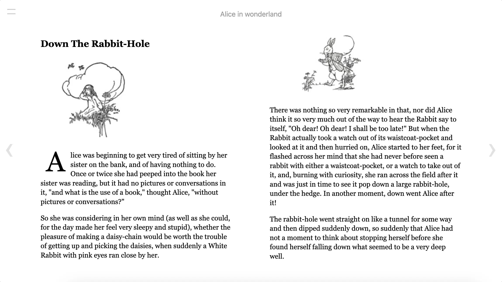

# React Reader - an easy way to embed a ePub into your webapp

React Reader is a react-wrapper for [epub.js](https://github.com/futurepress/epub.js) - an iframe based epub-reader that can run in browser, cordova and other web-based enviroments.

[See demo](https://react-reader.metabits.no)


## Install

`npm i react-reader`

## Usage

At the minimum you will need to give `ReactReader` you will need this:

- An url that points to the epub-file
- location (in epub) and a locationChanged function to store the change in location
- Set a height for the container

```tsx
import React, { useState } from 'react'
import { ReactReader } from 'react-reader'

export const App = () => {
  const [location, setLocation] = useState<string | number>(0)
  return (
    <div style={{ height: '100vh' }}>
      <ReactReader
        url="https://react-reader.metabits.no/files/alice.epub"
        location={location}
        locationChanged={(epubcfi: string) => setLocation(epubcfi)}
      />
    </div>
  )
}
```

This will render a reader like this:



### ReactReader props

- `title` [string] - the title of the book, displayed above the reading-canvas
- `showToc` [boolean] - whether to show the toc / toc-nav
- `readerStyles` [object] - override the default styles
- `epubViewStyles` [object] - override the default styles for inner EpubView
- `swipeable` [boolean, default false] - enable swiping left/right with [react-swipeable](https://github.com/dogfessional/react-swipeable). _Warning_ this will disable interacting with epub.js iframe content like selection

### ReactReader props passed to inner EpubView

- `url` [string, required] - url to the epub-file, if its on another domain, remember to add cors for the file. Epubjs fetch this by a http-call, so it need to be public available.
- `loadingView` [element] - if you want to customize the loadingView
- `location` [string, number, null] - set / update location of the epub
- `locationChanged` [func] - a function that receives the current location while user is reading. This function is called everytime the page changes, and also when it first renders.
- `tocChanged` [func] - when the reader has parsed the book you will receive an array of the chapters
- `epubInitOptions` [object] - pass custom properties to the epub init function, see [epub.js](http://epubjs.org/documentation/0.3/#epub)
- `epubOptions` [object] - pass custom properties to the epub rendition, see [epub.js's book.renderTo function](http://epubjs.org/documentation/0.3/#rendition)
- `getRendition` [func] - when epubjs has rendered the epub-file you can get access to the epubjs-rendition object here
- `isRTL` [boolean] - support for RTL reading direction, thanks to @ktpm489

### EpubView props

`EpubView` is just the iframe-view from EpubJS if you would like to build the reader yourself, see above for props

## Recipes and tips

### TypeScript support

`ReactReader` is now fully written in Typescript, so your editor should give you information of types for all props.

(thanks to for earlier contributions [@rafaelsaback](#63))

### Change font-size

See Basic example:

[See demo](https://react-reader.metabits.no) / [Source](src/examples/Basic.tsx)

### Save and retrieve progress from storage

Use a state from local-storage.

[See demo](https://react-reader.metabits.no/persist) / [Source](src/examples/Persist.tsx)

### Customize styles for ReactReader

Override styles for ReactReader and Epub.js for multiple themes

[See demo](https://react-reader.metabits.no/styling) / [Source](src/examples/Styling.tsx)

### Display page number for current chapter

Epub.js is only rendering the current chapter so we can only get the current page and number of pages within this chapter.

[See demo](https://react-reader.metabits.no/paging) / [Source](src/examples/Paging.tsx)

### Hightlight selection in epub

This shows how to hook into epubJS annotations object and let the user highlight selection and store this in a list where user can go to a selection or delete it.

[See demo](https://react-reader.metabits.no/selection) / [Source](src/examples/Selection.tsx)

### Handling missing mime-types on server

EpubJS will try to parse the epub-file you pass to it, but if the server send wrong mine-types or the file does not contain `.epub` you can use the epubInitOptions prop to force reading it right.

```tsx
import React from 'react'
import { ReactReader } from 'react-reader'

const App = () => {
  return (
    <div style={{ height: '100vh' }}>
      <ReactReader
        url="/my-epub-service"
        epubInitOptions={{
          openAs: 'epub',
        }}
      />
    </div>
  )
}
```

### Display a scrolled epub-view

Pass options for this into epubJS in the prop `epubOptions`

[See demo](https://react-reader.metabits.no/scroll) / [Source](src/examples/Scroll.tsx)

Quick reference for manager and flow options:

```ts
enum ManagerOptions {
  default = 'default', // Default setting, use when flow is set to auto/paginated.
  continuous = 'continuous', // Renders stuff offscreen, use when flow is set to "scrolled".
}

enum FlowOptions {
  default = 'auto', // Based on OPF settings, defaults to "paginated"
  paginated = 'paginated', // Left to right, paginated rendering. Better paired with the default manager.
  scrolled = 'scrolled', // Scrolled viewing, works best with "continuous" manager.
}
```

Things will look weird if you use the wrong manager/flow combination.

## Limitations

EpubJS is a browser-based epub-reader and it works by rendering the current epub-chapter into an iframe, and then by css-columns it will display the current page.

- EpubJS will need to render the current chapter before it will now how many pages it will have in the current viewport. Because of this it will not be able to tell you at which page in the whole epub-book you are at, nor will you be able to get the total pages for the whole book
- Performance for a web-based epub-reader will not be the same as native readers.
- EpubJS support `epub 2` standard, but most `epub 3` features should work since its based on regular html-tags, but there can be more issues with those [See Epub on Wikipedia](https://en.wikipedia.org/wiki/EPUB)

Also be aware that the epub-standard is basically a zip of html-files, and there is a range in quality. Most publishers create pretty ok epubs, but in some older books there could be errors that will make rendering fails.

### Handling not valid epub-files

A tip if you have problems with not valid epub-files is to override the build in DOMParser and modify the markup-string passed to its parseFromString function. This example fixes a not valid `<title/>` tag in an old epub, which would render as a blank page if not fixed:

```
const DOMParser = window.DOMParser

class OwnParser {
  parseFromString(markup, mime) {
    if (markup.indexOf('<title/>') !== -1) {
      markup = markup.replace('<title/>', '');
    }
    return new DOMParser().parseFromString(markup, mime)
  }
}

window.DOMParser = OwnParser
```

### Enable opening links / running scripts inside epubjs iframe

Epubjs is rendering the epub-content inside and iframe which defaults to `sandbox="allow-same-origin"`, to enable opening links or running javascript in an epub, you will need to pass some extra params in the `epubOptions` prop.

```
<ReactReader
  url={localFile}
  epubOptions={{
    allowPopups: true, // Adds `allow-popups` to sandbox-attribute
    allowScriptedContent: true, // Adds `allow-scripts` to sandbox-attribute
  }}
/>
```
